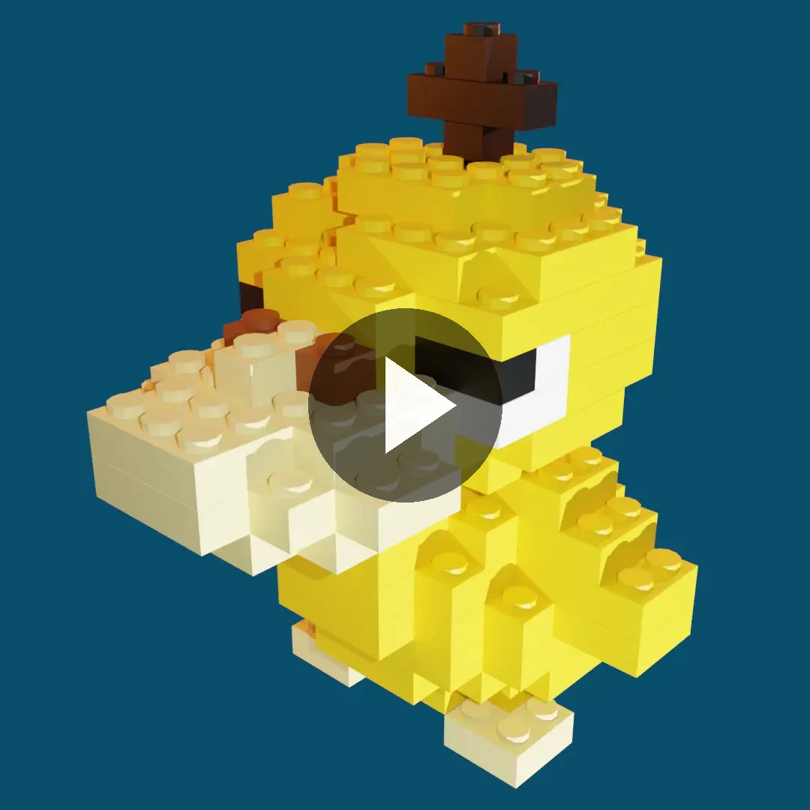
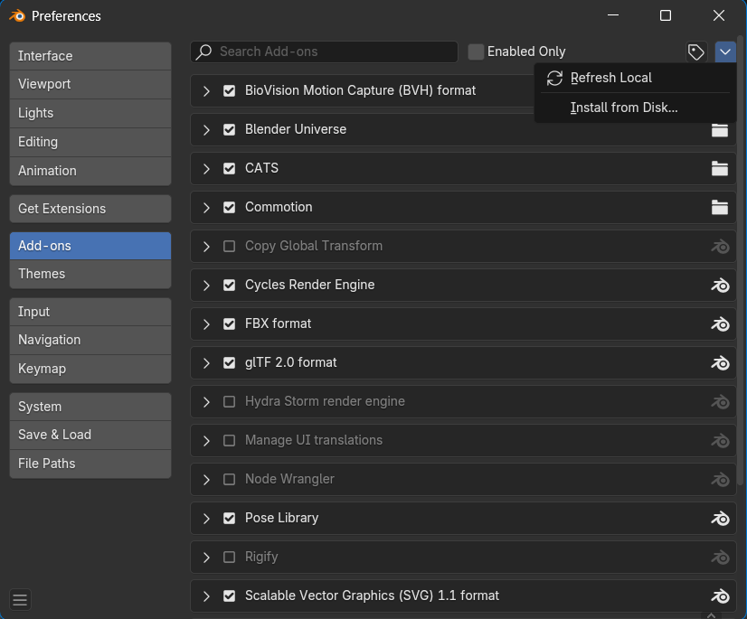
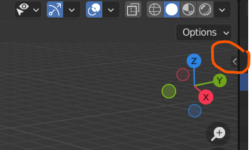
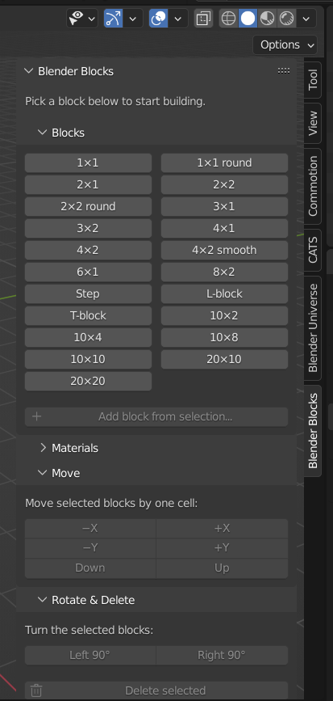
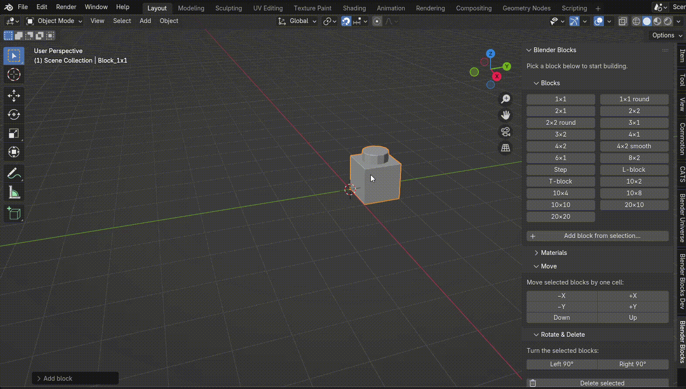
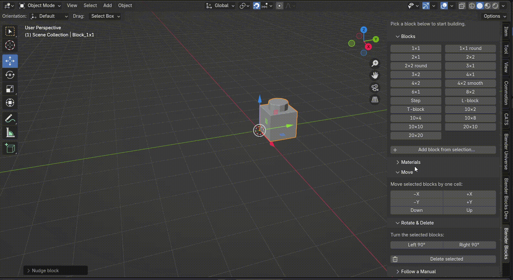

# Blender Blocks
## hi!!! helloo!!! heyyy :-))
In high school, I remember excitedly getting home from school, tuning into Alpha Brain Waves on my headphones, opening up Blender 3D, and following NanoBlock manuals with my custom-made LEGO bricks.

It was so super relaxing, and I miss it!! 

It was so much fun to turn my brain off for a bit and just place blocks on top of each other until the build took shape! And I looooved to play around with materials and colours and with the final render (because Blender does such a beautiful job of making everything look SO REAL).

Here are some things I built (with Nanoblock's manuals !!):

Wow. Just look at that beautiful, crisp Cycles rendering.

Most parts I missed, but some parts really sucked... I had to copy paste blocks every time, and keeping track of where my template, copy-able block was, unhiding it so I could copy it, and then pasting it again was super tedious.

Back then, I wanted to build a Blender add-on for basic block summoning and material setting, but I didn't get very far. But now, here it is!!! Mainly this is to make a childhood dream come true... and now I can also get back into the hours of Alpha Brain Waves and brick building that I used to do.

## Features
- grid snapping!!
- on-demand default block summoning!!!
- if a block is misisng, I can make it myself and add it to the library :D
- easy material assignment!! wahoo
- voxel import -> blender block manual (yippee!! Now I do not have to rely on Nanoblock!! Haven't tried it yet though.)
  - "Why would I want to build something in MagicaVoxel and then again in Blender? That is so pointless." Well, I like it, so whatever...

## Download
1. Download [snablock.zip](blender_blocks.zip) and [Blender](https://www.blender.org/download/) (have not tested this on anything other than Blender 4.5, but should work on Blender 4.2+)
2. In Blender, go to Edit>Preferences>Add-ons
3. Click the chevron in the top right coner, and click Install from Disk

4. Find the zip file in your filepath and click it!
5. Make sure the check is ticked next to it in the add-ons library, then close out of the window.

Now you will find it in your add on menu (right side of the default viewport)!

## How to use? The basics
- click on one of the preset blocks in the list of blocks (1x1, 2x1, etc) to summon them onto the screen
- move blocks around with 
  - g -> move mouse around,
  - the 'move' tool in Blender's left side bar & drag arrows, OR
  - the buttons in the add on

- select a colour under the add on's materials tab to change the colour of a brick

## Code
Written in Python against Blender's API (`bpy`), for Blender 4.2+.

Great thanks to Claude Code for helping my dream come to life... here are some cool things that it did along the way
- some cool math on my pre-made bricks to normalize all origin points, scales, and rotations
- built on some code I wrote waay back when I first attempted this project
- custom MCP server add on just for testing the add on's changes :0 (less work for me.. hooray)
- help with custom Nanoblock-style manuals on voxel import !!! so cool !!!!

## Coming up
- Maybe I will make my own version of Commotion just for LEGO building so it builds in an order that actually makes sense (sometimes Commotion does not do that)